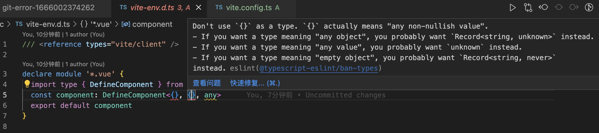

## 2022-10-17
1. eslilnt + prettier
    > eslint: 可组装的JavaScript和JSX检查工具
    1. pnpm install -D eslint
    2. pnpm eslint --init
    3. pnpm install -D --save-exact prettier
       - echo {}> .prettierrc.json
       - 新建.prettierignore
       - 在.prettierigore中添加
            ```javascript
                # Ignore artifacts:
                build
                coverage
            ``` 
    4. pnpm install -D eslint-config-prettier
        ```javascript
        /** ./.eslintrc.cjs */
        module.exports = {
            ...
            extends: [
                ...
                'prettier'
            ]
        }
        ```
    

    ```javascript
    // .eslintrc.cjs
    "rules": {
        // 解决 Don‘t use `{}` as a type. `{}` actually means “any non-nullish value“
        "@typescript-eslint/ban-types": [
            "error",
            {
                "extendDefaults": true,
                "types": {
                    "{}": false
                }
            }
        ]
    }
        ```
2. alias @
    ```javascript
    // vite.config.ts
    export default defineConfig(() => {
        return {
            resolve: {
            alias: {
                "@": resolve(__dirname, "./src")
            }
            },
            plugins: [vue()]
        }
        })
    ```
3. husky + lint-staged + commitlint ([husky官网](https://typicode.github.io/husky/#/?id=automatic-recommended/)) ([husky + lint-staged配置](https://juejin.cn/post/6982876819292684318/))
    1. pnpm dlx husky-init && pnpm install # pnpm
    2. npx husky add .husky/commit-msg 'npx --no -- commitlint --edit "$1"'
    3. pnpm install lint-staged
       ```javascript
       // package.json
       "scripts": {
            ...
            "pre-commit": "lint-staged"
        },
        ...
        "lint-staged": {
            "*.{js,vue,ts,tsx}": [
            "eslint --fix",
            "git add"
            ]
        }
        // .husky/pre-commit
        ...
        pnpm pre-commit

       ```
    4. pnpm install  @commitlint/config-conventional
        新建commitlint.config.cjs
        ```javascript
        module.exports = {
            extends: [
                '@commitlint/config-conventional'
            ]
        }
        ```
 