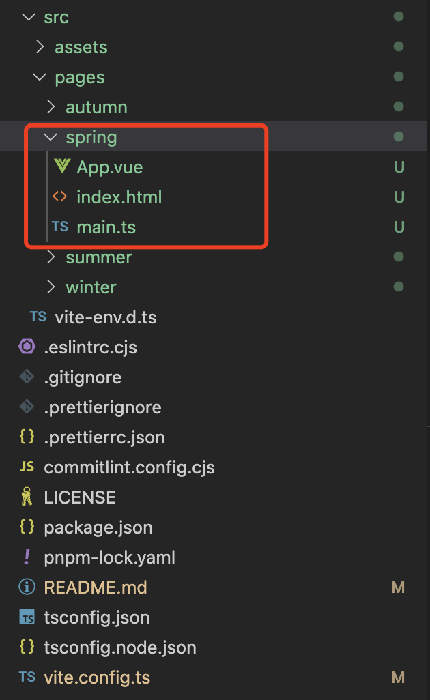
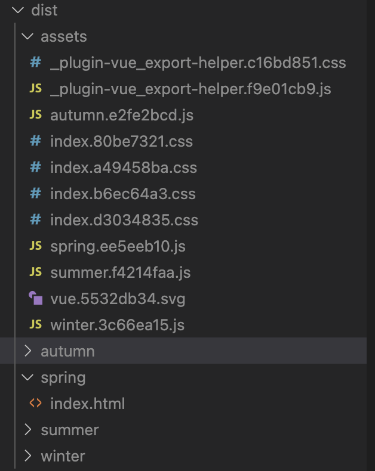

## 2022-10-19

### 多页打包

1. 修改项目结构
   
   其中红框为多页面的单个页面的结构

2. 修改 vite.config.ts

```javascript
{
    root:"src/pages/", // 制定多页面的根目录
    base: "", // 指定打包后的js路径
    ...
    build: { // rollup打包配置
      rollupOptions: {
        input: {
          spring: resolve(__dirname, "src/pages/spring/index.html"),
          summer: resolve(__dirname, "src/pages/summer/index.html"),
        },
        output: {
          dir: "./dist",
        },
      },
    },
};
```

pnpm run dev
http://127.0.0.1:5173/spring/index.html

pnpm run build 目录结构

