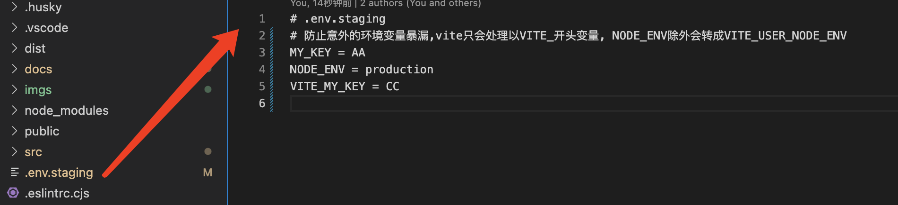
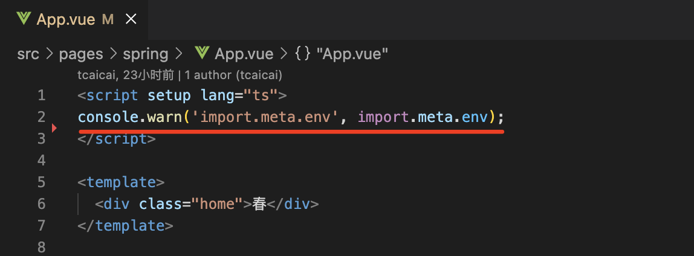
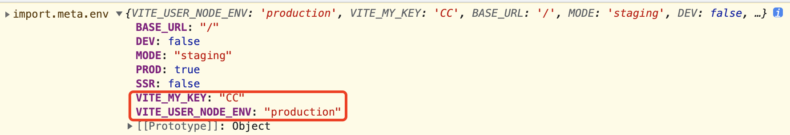
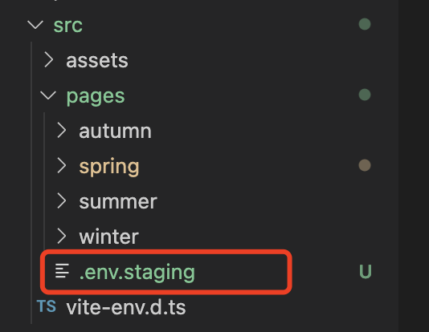

# 环境变量

> Vite 在一个特殊的 import.meta.env 对象上暴露环境变量。这里有一些在所有情况下都可以使用的内建变量
>
> ```javascript
> interface ImportMetaEnv {
>   [key: string]: any
>   BASE_URL: string
>   MODE: string
>   DEV: boolean
>   PROD: boolean
>   SSR: boolean
> }
> ```

定义方式也非常简单在项目跟目录创建文件，文件名.env.{mode}(mode 自行定义)，这样在 package.json 的 scripts 定义相应的 mode 指令就可以了，举个 🌰

1. 第一步，创建文件
   
2. 第二部，添加指令

```javascript
"test-stage": "vite --mode staging"
```

3. 第三步，打印输出
   

4. 第四部，执行命令

```javascript
pnpm run test-stage
```

5. 第五步，打印验证
   

这样一个自定义的环境变量就设置成功了，撒花 🎉🎉🎉

但是。。可但是。。因为我们更改了 vite.config.ts 中的配置属性 root，自定义环境变量无法正确的引入到 env 中 😭😭😭😭😭😭

那接下来就解决下.env 无法生效的问题

## 方法一

第一步：安装

```javascript
pnpm install dotenv -D
```

第二部：修改 vite.config.ts, 手动将.env.{mode}配置进去

```javascript
import * as dotenv from 'dotenv';
...
dotenv.config({ path: `./.env.${mode}` });
```

## 方法二

因为我们更改了 root="src/pages/", 那我们就在 pages 下创建环境变量文件


⚠️ 温馨提示：在代码中添加 ts 的智能提醒，修改 vite-env.d.ts

```javascript
interface ImportMetaEnv {
  readonly NODE_ENV: string;
  readonly VITE_MY_KEY: string;
  readonly VITE_APP_TITLE: string;
}

interface ImportMeta {
  readonly env: ImportMetaEnv;
}
```
