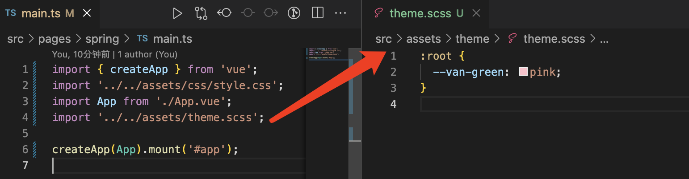

# vant 组件库引入

## 安装

```javascript
pnpm add vant
```

## 按需引入

```javascript
pnpm add unplugin-vue-components -D
```

## 配置插件

```javascript
import Components from 'unplugin-vue-components/vite';
import { VantResolver } from 'unplugin-vue-components/resolvers';

export default {
  plugins: [
    ...Components({
      resolvers: [VantResolver()],
    }),
  ],
};
```

## 自定义 theme 设置 [vant 主题参考](https://vant-ui.github.io/vant/#/zh-CN/config-provider)



## 函数组件调用(以 Notify 为例)

```javascript
import { Notify } from 'vant';
import 'vant/es/notify/style';

const onSpringBtn = () => {
  Notify({ type: 'success', message: '春暖花开', duration: 1000 });
};
```
